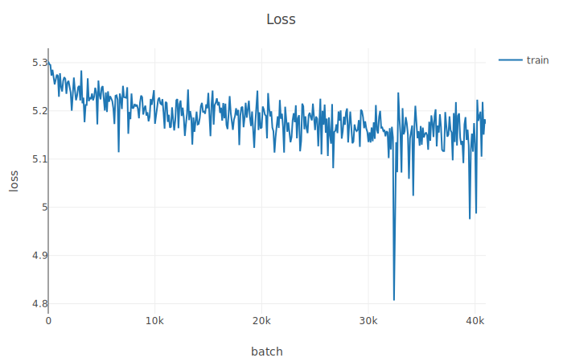
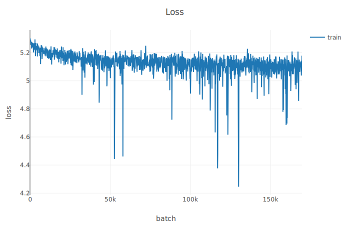
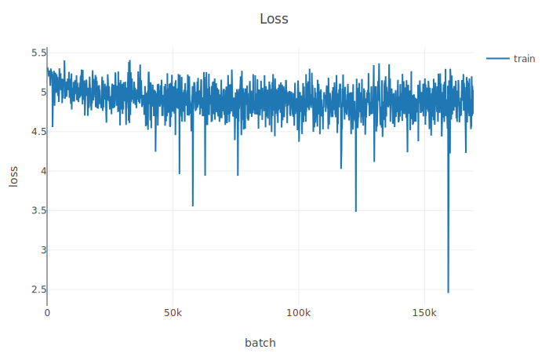

Log of my research experience, just for kicks. 
This is 95% complaints and 5% unintelligible.

### 04-28-2019: 
---
Basically converted all the code to python3 for quick thoughts, but now I need to get the eval scripts set up.

Why are people using python2 in 2019?...

Got training working + training on GPU - saw a 40x speedup (thank god).

### 04-29-2019:
---
And then I fucked up by running 
```
    chown -R jcaip /
```
by accident today... looks like when my system reboots I'll be screwed (and reinstall), but at least it's running fine right now.

JFC just trying to run this code is a PITA. looks like skip-thoughts, the original paper, needs to be cloned as well, but it uses freaking python2.7, so converting it here.

Honestly, I should probably just get this running with 2.7..... that's a bit of a bitter pill to swallow.

I just did it :(

### 05-05-2019:
---
So some good progress today, finally got the dataset part working, and build a simple BOW max encoder. 

Now working on the model, actually seems to be going pretty well. 
Looks like I can just slap a softmax on top and do some shit, so no need to write it all myself. 

For now, just testing to see if I can get a full training script to run.

I got it working, but it looks like torchtext can't really handle the huge file well - so just going to use the simple approach and write some wrapper python. 

A little peeved, because i thought torchtext would handle this better - although tbf I'm probably not using it properly.
Actually, i could totally see it being an ease of use and not a speed thing, because writing this now is a pita.

I probably should have just split the file into multiple datasets, and then iterated through each set....

and then figure out a different way to build the vocab?

Finally some good news - got a basic testing script running, and it's able to handle all of BC.

even better news - I added in visdom...

now making progress on getting an lstm encoder, since it didn't look like the training was right.

- added in gradient clipping too, so today has been a nice day productivity wise.

maybe I should buy some more ram? looks like this whole thing uses just about 32 gigs.

But overall a bunch of good progress today.

CUDA working now too!

Really now i just need to focus on - some basic evaluation (nearest neighbors?)
and then speeding it up as much as possible

Came up with a realitvely shitty evaluation idea, but it was fast to implement. 

Basically i came up with 4 sentences with varying degree of simularity (sujbjectively), and then I'm just going to inspect the scores matrix manually. 

Also I can inspect the scores matrix for the data, now that I know what that looks like

Also added in checkpointing, so now this is running forreal for at least a night.... wonder what's going to

### 05-06-19:
---

OK it looks like visdom is a piece of shit that hangs - stopping the running script, so I took it out. Pretty disappointed in it.

^^ This actually might have been my fault, it's entirely possible I sent something over intmax as a loss.

Also my computer crashed overnight so doubly not visdom's fault

Took some time to refactor Now i got it all split up into a somewhat reasonable structure

figuered out the BCE loss thing was fucked, changed to softmax + KL divergence

- this was a big find, I'm glad I got that done

added back in visdom

So some good work, running a real experiment rn, and it looks promising so far.

I should really take a look at speeding up the dataset/dataloader. It definitely looks like I'm CPU bound atm - pegged at cpu, but on gpu utilization im seeing waiting periods.

Also pet peeve - I don't know what they did to the PyTorch documenation but now I'll hang for a bit before scrolling. TBH i just wish they kept the old documentation, as it was faster, even though I have to admit it does look slicker now. 

changed the Bookcorpus dataset so it is all in memory -> shouldn't be CPU bound hopefully.

for GPU: Seeing the same 3GB usage as described in the paper :+1: and pinned at 99% utilization

Getting this weird error only some of the time so idk but at least it's running now
```
Traceback (most recent call last):
  File "train.py", line 21, in <module>
    qt = QuickThoughts()
  File "/home/jcaip/workspace/quickthoughts/src/qt_model.py", line 29, in __init__
    self.enc_f = Encoder(wv_model).cuda()
  File "/home/jcaip/.conda/envs/ml/lib/python3.7/site-packages/torch/nn/modules/module.py", line 260, in cuda
    return self._apply(lambda t: t.cuda(device))
  File "/home/jcaip/.conda/envs/ml/lib/python3.7/site-packages/torch/nn/modules/module.py", line 187, in _apply
    module._apply(fn)
  File "/home/jcaip/.conda/envs/ml/lib/python3.7/site-packages/torch/nn/modules/module.py", line 193, in _apply
    param.data = fn(param.data)
  File "/home/jcaip/.conda/envs/ml/lib/python3.7/site-packages/torch/nn/modules/module.py", line 260, in <lambda>
    return self._apply(lambda t: t.cuda(device))
RuntimeError: CUDA out of memory. Tried to allocate 11.50 MiB (....)
```

looks like ~4minutes for 1000 batches -> approximtely 68 million / 400 * 4 minuts ~= 11 hours, which is what is descibed in the paper.

Ran into a problem with zero  lenght vectors, so i just added in a try catch/.

And then I got some weird 
```
bus error (core dumped)
```
Maybe want a way to resume training?

Basically my desktop is a little too jank to run right now, so I'm moving to cloud solutions - but that means I need to set up my laptop appropriately.

Ugh I hate this, wish I had a good setup already. Probably just going to wait for GCP.

In the meantime rerunning the code with hopes that it won't error out - if it does again I'm going to work on stateful training. So far the fathest I've gotten is 20k batches, a little more than 1/10 of the entire dataset.

I need to fix the rnn pack_padded_sequence, pad_packed_sequence bullshit. 

But in the meantime the script has . now hit just about 55k batches, which is great.

I guess applications for this are:
  semantic search? 

### 05-07-2019
----

A lot more progress today, I'm up and running on GCP. 

In short:
  - correctly implemented getting the last inputs
  - changed the collate_fn to a safe_one to handle zero length sequences
  - also wrote a preprocessing scrip to strip zero length seq out
  - can now pause/resume training as you please

So now I just need these runs to resolve, which will take some time. Then work on evaluating the resulting vectors.

### 05-08-19
---

Switched to V100 GPU on GCP - need to make sure I'm not outliving my credits.

It looks like both of my training runs dies at ~70k iterations? So this may be a reproducable issue - I added in resume training so I may be able to test this. 

I had difficulty trying to ssh into the GCP instance - I had to restart it, and the run seemed to have hung.

So it looks like that'll be the primary thing I'll be trying to fix today.

I also got ahead of myself with rewriting the code. :( Refactor is completely broken.
I need a smaller dataset to test my scripts with

In the meantime here's a curve:




Looks like it died at 70k because I was writing to file too much and there was an error there.

```
RuntimeError: unable to write to file </torch_30135_3865702978>
Traceback (most recent call last):
  File "/opt/anaconda3/lib/python3.7/multiprocessing/queues.py", line 236, in _feed
    obj = _ForkingPickler.dumps(obj)
  File "/opt/anaconda3/lib/python3.7/multiprocessing/reduction.py", line 51, in dumps
    cls(buf, protocol).dump(obj)
  File "/opt/anaconda3/lib/python3.7/site-packages/torch/multiprocessing/reductions.py", line 315, in reduce_storage
    fd, size = storage._share_fd_()
```

On the bright side resume training is currently confirmed working :+1:. Should have a result soon.

Actually I keep on getting this problem -> so i thnk it's a problem with the data probably. 

Changed the data loader to just use 1 worker and it seems fine. 

I really need to split the dataset up into multiple files and handle it that way.

also visdom may not be the best logging solution -> can't start and stop over time.

### 05-09-19
---
noticed that the norm threshold should be 5.0, so reran with that
Alright this is the last run:



So this training is not perfect, I really just need to focus on
- fixing the refactor and getting a release finished
- evaluate the resulting sentence vectors

Pausing GCP in the meantime - I might need more credits.

I think I'm good with the refactor actually - let's work on evaluation metrics?

Refactor is going well actually, now working on evaluation metrics - MR specifically. 

I ripped the code from here: https://github.com/ryankiros/skip-thoughts in order to do the classification. 

I need to handle this 0-sequence thing better, but I'm not sure how? 

Once i get this evaluation script running better I should convert to tensorboard and run with these metrics, but just taking it one day at a time. 

ugh this evaluation thing is such a PITA, I think i got a baseline working just now. 

Still it's an absolute pain to essentially port over code...

alright now its good tho, running a new run with 50k vocab size, and will test on that

In the meantime, the evaluation script needs to be cleaned up- which i did, and fixed whatever previous bug was there ( it wasn't 0 sequences )

I was concating tensors in the wrong dimension, so I fixed that as well. :+1:

Evaluation script finally working: end result? **60%** Accuracy on MR dataset :( so still need to try and figure out where stuff is going wrong, but overall a pretty productive day.

### 05-09-19
---
So ran with 50k, heres a new loss curve, now no rolling average



And heres the MR classification results:
```
INFO     Found best C=  1 with accuracy: 61.18% in 192.30 seconds | Test Accuracy: 63.26%
INFO     Found best C=  1 with accuracy: 61.42% in 193.70 seconds | Test Accuracy: 62.98%
INFO     Found best C=  2 with accuracy: 61.70% in 193.55 seconds | Test Accuracy: 60.41%
INFO     Found best C=  1 with accuracy: 61.90% in 193.55 seconds | Test Accuracy: 59.47%
INFO     Found best C=  4 with accuracy: 61.53% in 193.62 seconds | Test Accuracy: 59.85%
INFO     Found best C=256 with accuracy: 61.14% in 191.16 seconds | Test Accuracy: 60.69%
INFO     Found best C=  1 with accuracy: 61.70% in 190.15 seconds | Test Accuracy: 63.70%
INFO     Found best C=128 with accuracy: 60.97% in 189.51 seconds | Test Accuracy: 62.57%
INFO     Found best C=  1 with accuracy: 60.85% in 187.81 seconds | Test Accuracy: 63.04%
INFO     Found best C=  1 with accuracy: 61.93% in 186.22 seconds | Test Accuracy: 60.51%
INFO     Finished Evaluation of MR | Accuracy: 0.6164857018767 | Total Time: 1919.0481956005096
```

Need to try bumping the hidden dimension (1000 -> 2400) and also Glove instead of word2vec vectors, but I think that's enough for right now


### 05-13-19
---
So reviewing for the midterm, had a couple of ideas to improve this paper. 
Transformer encoder
scaling the softmax targets. (closer should be more related, further apart still related but less.) 

I should set up tensorboardX stuff too, I need more information to make a better decision. 