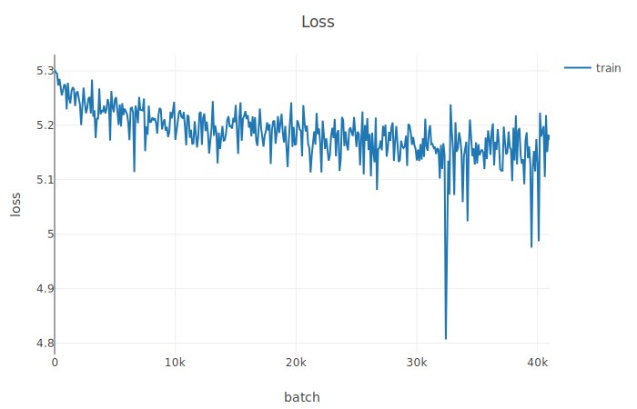
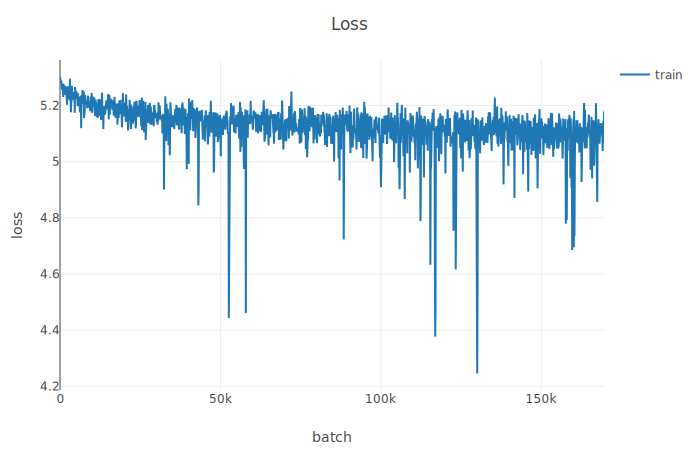
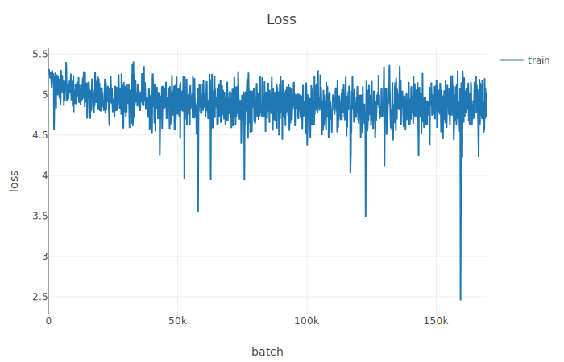
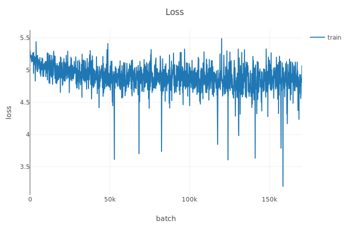
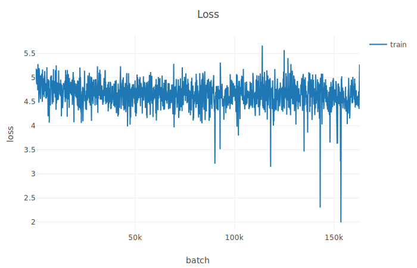

# Research Log (2019)

Log of my research experience, just for kicks. 
This is 95% complaints and 5% unintelligible.

### 04-28-19: 
---
Basically converted all the code to python3 for quick thoughts, but now I need to get the eval scripts set up.

Why are people using python2 in 2019?...

Got training working + training on GPU - saw a 40x speedup (thank god).

### 04-29-19:
---
And then I fucked up by running 
```
    chown -R jcaip /
```
by accident today... looks like when my system reboots I'll be screwed (and reinstall), but at least it's running fine right now.

JFC just trying to run this code is a PITA. looks like skip-thoughts, the original paper, needs to be cloned as well, but it uses freaking python2.7, so converting it here.

Honestly, I should probably just get this running with 2.7..... that's a bit of a bitter pill to swallow.

I just did it :(

### 05-05-19:
---
So some good progress today, finally got the dataset part working, and build a simple BOW max encoder. 

Now working on the model, actually seems to be going pretty well. 
Looks like I can just slap a softmax on top and do some shit, so no need to write it all myself. 

For now, just testing to see if I can get a full training script to run.

I got it working, but it looks like torchtext can't really handle the huge file well - so just going to use the simple approach and write some wrapper python. 

A little peeved, because i thought torchtext would handle this better - although tbf I'm probably not using it properly.
Actually, i could totally see it being an ease of use and not a speed thing, because writing this now is a pita.

I probably should have just split the file into multiple datasets, and then iterated through each set....

and then figure out a different way to build the vocab?

Finally some good news - got a basic testing script running, and it's able to handle all of BC.

even better news - I added in visdom...

now making progress on getting an lstm encoder, since it didn't look like the training was right.

- added in gradient clipping too, so today has been a nice day productivity wise.

maybe I should buy some more ram? looks like this whole thing uses just about 32 gigs.

But overall a bunch of good progress today.

CUDA working now too!

Really now i just need to focus on - some basic evaluation (nearest neighbors?)
and then speeding it up as much as possible

Came up with a realitvely shitty evaluation idea, but it was fast to implement. 

Basically i came up with 4 sentences with varying degree of simularity (sujbjectively), and then I'm just going to inspect the scores matrix manually. 

Also I can inspect the scores matrix for the data, now that I know what that looks like

Also added in checkpointing, so now this is running forreal for at least a night.... wonder what's going to

### 05-06-19:
---

OK it looks like visdom is a piece of shit that hangs - stopping the running script, so I took it out. Pretty disappointed in it.

^^ This actually might have been my fault, it's entirely possible I sent something over intmax as a loss.

Also my computer crashed overnight so doubly not visdom's fault

Took some time to refactor Now i got it all split up into a somewhat reasonable structure

figuered out the BCE loss thing was fucked, changed to softmax + KL divergence

- this was a big find, I'm glad I got that done

added back in visdom

So some good work, running a real experiment rn, and it looks promising so far.

I should really take a look at speeding up the dataset/dataloader. It definitely looks like I'm CPU bound atm - pegged at cpu, but on gpu utilization im seeing waiting periods.

Also pet peeve - I don't know what they did to the PyTorch documenation but now I'll hang for a bit before scrolling. TBH i just wish they kept the old documentation, as it was faster, even though I have to admit it does look slicker now. 

changed the Bookcorpus dataset so it is all in memory -> shouldn't be CPU bound hopefully.

for GPU: Seeing the same 3GB usage as described in the paper :+1: and pinned at 99% utilization

Getting this weird error only some of the time so idk but at least it's running now
```
Traceback (most recent call last):
  File "train.py", line 21, in <module>
    qt = QuickThoughts()
  File "/home/jcaip/workspace/quickthoughts/src/qt_model.py", line 29, in __init__
    self.enc_f = Encoder(wv_model).cuda()
  File "/home/jcaip/.conda/envs/ml/lib/python3.7/site-packages/torch/nn/modules/module.py", line 260, in cuda
    return self._apply(lambda t: t.cuda(device))
  File "/home/jcaip/.conda/envs/ml/lib/python3.7/site-packages/torch/nn/modules/module.py", line 187, in _apply
    module._apply(fn)
  File "/home/jcaip/.conda/envs/ml/lib/python3.7/site-packages/torch/nn/modules/module.py", line 193, in _apply
    param.data = fn(param.data)
  File "/home/jcaip/.conda/envs/ml/lib/python3.7/site-packages/torch/nn/modules/module.py", line 260, in <lambda>
    return self._apply(lambda t: t.cuda(device))
RuntimeError: CUDA out of memory. Tried to allocate 11.50 MiB (....)
```

looks like ~4minutes for 1000 batches -> approximtely 68 million / 400 * 4 minuts ~= 11 hours, which is what is descibed in the paper.

Ran into a problem with zero  lenght vectors, so i just added in a try catch/.

And then I got some weird 
```
bus error (core dumped)
```
Maybe want a way to resume training?

Basically my desktop is a little too jank to run right now, so I'm moving to cloud solutions - but that means I need to set up my laptop appropriately.

Ugh I hate this, wish I had a good setup already. Probably just going to wait for GCP.

In the meantime rerunning the code with hopes that it won't error out - if it does again I'm going to work on stateful training. So far the fathest I've gotten is 20k batches, a little more than 1/10 of the entire dataset.

I need to fix the rnn pack_padded_sequence, pad_packed_sequence bullshit. 

But in the meantime the script has . now hit just about 55k batches, which is great.

I guess applications for this are:
  semantic search? 

### 05-07-19:
----

A lot more progress today, I'm up and running on GCP. 

In short:
  - correctly implemented getting the last inputs
  - changed the collate_fn to a safe_one to handle zero length sequences
  - also wrote a preprocessing scrip to strip zero length seq out
  - can now pause/resume training as you please

So now I just need these runs to resolve, which will take some time. Then work on evaluating the resulting vectors.

### 05-08-19:
---

Switched to V100 GPU on GCP - need to make sure I'm not outliving my credits.

It looks like both of my training runs dies at ~70k iterations? So this may be a reproducable issue - I added in resume training so I may be able to test this. 

I had difficulty trying to ssh into the GCP instance - I had to restart it, and the run seemed to have hung.

So it looks like that'll be the primary thing I'll be trying to fix today.

I also got ahead of myself with rewriting the code. :( Refactor is completely broken.
I need a smaller dataset to test my scripts with

In the meantime here's a curve:




Looks like it died at 70k because I was writing to file too much and there was an error there.

```
RuntimeError: unable to write to file </torch_30135_3865702978>
Traceback (most recent call last):
  File "/opt/anaconda3/lib/python3.7/multiprocessing/queues.py", line 236, in _feed
    obj = _ForkingPickler.dumps(obj)
  File "/opt/anaconda3/lib/python3.7/multiprocessing/reduction.py", line 51, in dumps
    cls(buf, protocol).dump(obj)
  File "/opt/anaconda3/lib/python3.7/site-packages/torch/multiprocessing/reductions.py", line 315, in reduce_storage
    fd, size = storage._share_fd_()
```

On the bright side resume training is currently confirmed working :+1:. Should have a result soon.

Actually I keep on getting this problem -> so i thnk it's a problem with the data probably. 

Changed the data loader to just use 1 worker and it seems fine. 

I really need to split the dataset up into multiple files and handle it that way.

also visdom may not be the best logging solution -> can't start and stop over time.

### 05-09-19:
---
noticed that the norm threshold should be 5.0, so reran with that
Alright this is the last run:



So this training is not perfect, I really just need to focus on
- fixing the refactor and getting a release finished
- evaluate the resulting sentence vectors

Pausing GCP in the meantime - I might need more credits.

I think I'm good with the refactor actually - let's work on evaluation metrics?

Refactor is going well actually, now working on evaluation metrics - MR specifically. 

I ripped the code from here: https://github.com/ryankiros/skip-thoughts in order to do the classification. 

I need to handle this 0-sequence thing better, but I'm not sure how? 

Once i get this evaluation script running better I should convert to tensorboard and run with these metrics, but just taking it one day at a time. 

ugh this evaluation thing is such a PITA, I think i got a baseline working just now. 

Still it's an absolute pain to essentially port over code...

alright now its good tho, running a new run with 50k vocab size, and will test on that

In the meantime, the evaluation script needs to be cleaned up- which i did, and fixed whatever previous bug was there ( it wasn't 0 sequences )

I was concating tensors in the wrong dimension, so I fixed that as well. :+1:

Evaluation script finally working: end result? **60%** Accuracy on MR dataset :( so still need to try and figure out where stuff is going wrong, but overall a pretty productive day.

### 05-09-19:
---
So ran with 50k, heres a new loss curve, now no rolling average



And heres the MR classification results:
```
INFO     Found best C=  1 with accuracy: 61.18% in 192.30 seconds | Test Accuracy: 63.26%
INFO     Found best C=  1 with accuracy: 61.42% in 193.70 seconds | Test Accuracy: 62.98%
INFO     Found best C=  2 with accuracy: 61.70% in 193.55 seconds | Test Accuracy: 60.41%
INFO     Found best C=  1 with accuracy: 61.90% in 193.55 seconds | Test Accuracy: 59.47%
INFO     Found best C=  4 with accuracy: 61.53% in 193.62 seconds | Test Accuracy: 59.85%
INFO     Found best C=256 with accuracy: 61.14% in 191.16 seconds | Test Accuracy: 60.69%
INFO     Found best C=  1 with accuracy: 61.70% in 190.15 seconds | Test Accuracy: 63.70%
INFO     Found best C=128 with accuracy: 60.97% in 189.51 seconds | Test Accuracy: 62.57%
INFO     Found best C=  1 with accuracy: 60.85% in 187.81 seconds | Test Accuracy: 63.04%
INFO     Found best C=  1 with accuracy: 61.93% in 186.22 seconds | Test Accuracy: 60.51%
INFO     Finished Evaluation of MR | Accuracy: 61.65% | Total Time: 1919.0s
```

Need to try bumping the hidden dimension (1000 -> 2400) and also Glove instead of word2vec vectors, but I think that's enough for right now


### 05-13-19:
---
So reviewing for the midterm, had a couple of ideas to improve this paper. 
Transformer encoder
scaling the softmax targets. (closer should be more related, further apart still related but less.) 
- this actually seems like a halfway decent idea now that I think about it.

I should set up tensorboardX stuff too, I need more information to make a better decision. 

Maybe I should also do the vocab expansion thing mentioned?

Alright GCP is ass, apparently there's no available resources at the time. 

So now I'm running a run with glove vectors and 2400 dim on my computer. 

### 05-14-19:

So unfortunately bumping up the hidden dim and changing the word vectors used makes this thing run a lot longer...

But on the bright side, changing it took almost no time at all.

One thing I would like to perhaps figure out a little bit better is to handle 0-length sequence better, without having to preprocess the text file a bunch of times. 

But ATM I'm just going to wait for this run to finish, and perhaps bring up GCP in the meantime, and make some workflow improvements.

Also worth noting for posterity's sake that i observe about 10% of batches have a 0-length sequence. This is suprisingly consistent, but i guess law of large numbers.

I feel like the biggest reason i left blend was because I didn't wanna fuck with AWS shit.... but that's pretty much what I"m doing right now.
Also maybe try elmo word vectors? but first focus on replicating the results. spinning up a new GCP instance now.
Okay, actuall GCP is so stupid. If I create a new conda env with GCP conda, it's a 2.7 env, even thought the conda python is 3.x 

Finally got off my ass and doing a proper run, replicating everything from the paper except using pretrained word embeddings (glove) and a 4 mil vocab instead of 20000. 

rewrote the eval script a little bit, not sure it made it better but I tihnk at least I understand it better now.

So i think my thing died on visdom again :(
  I should probably look to switching over to tensorboardX

### 05-15-19:
---
Rerunning new run, should have results soon, looks like it took expected amount of time (~6.5 hours)



Loss curve def looks better than the one before, so I hope that the MR eval results are good...

```
2019-05-15 23:40:19 INFO     Finished Evaluation of MR | Accuracy: 61.54% | Total Time: 686.8
```

It's the exact same.... f u c k. Maybe I need to add in dropout?

i think my data preprocessing script has actually been broken this whole time ... so going to add in a sanity check somewhere. 

Maybe I should write some simple tests for the data code?

### 05-15-19:
---

Soooo, the last run finished. It turns out i was fucking up the data, treating characters as words


and the eval results:
```
2019-05-16 08:36:53 INFO     Finished Evaluation of MR | Accuracy: 76.19% | Total Time: 693.6
```

This is SOTA :) :) :) 

### 05-18-19:
---

Dealing with some more GCP problems, but effectively I got vector dot product search working.

```
Query sentence: i was really confused, I couldn't understand what was going on
Score: 22.78 | Sentence: the events of the film are just so weird that i honestly never knew what the hell was coming next .
Score: 22.15 | Sentence: i found myself more appreciative of what the director was trying to do than of what he had actually done .
Score: 21.82 | Sentence: i realized that no matter how fantastic reign of fire looked , its story was making no sense at all .
Score: 21.61 | Sentence: i wish i could say " thank god it's friday " , but the truth of the matter is i was glad when it was over .
Score: 21.47 | Sentence: deep down , i realized the harsh reality of my situation : i would leave the theater with a lower i . q . than when i had entered .
```

This is great, I just need to put some finishing touches on this project.

Looks like this is going to work out after all. I just need to do the following things to wrap up

- add evaluation for all binary classification tasks (TODO)
- add tests for some of the data functions (TODO)
- train with smoothed softmax distribution (DIDN'T WORK)
- train with transformer encoder network (IDK)
- train on UMBC dataset?
- write more documentation 
- look into CURL stuff?
  - this is more for insights 

But yeah this is good, good job jesse.

### 05-19-19:

GCP is now up and running. I'm looking at the CURL paper, and trying to make sense of it. 

In the meantime, I wrote a small test for smoothed softmax, based on the assumption that 
P(x2 R x0) = p(x2 R x1) P(x1 R x0) so the target distribution is better modeled as an exponential distribution. 

^^ This kind of comes from CURL

My hope is that this gives better gradients and thus better training and a better representation. 

Anywyas, the run in running right now, so fingers crossed.

It didn't work, it was like 75% accuarcy, so about the same 


### 05-20-19:

Okay looking at this CURL paper, I think false negative samples are the biggest problem here. The paper in particular mentions if too many postive samples are marked as negative this may lead to a problem. 
So the way I was thinking to solve that would be to do this weird sampling thing, that is to draw 20 sentences from 20 different places in the corpus, but I think it might not help a lot. 
Because the closest sentences are the most likely to be "wrong negative samples" so that's not good.

I would essentially have to do blocks of 4-5 sentences at a time. 

I think what would be better would be to chunk the sentences into paragraphs, and do the block paragraph training mentioned in the paper. 
... But that's a pretty big time commitment and I'm not sure if that's really feasible or not. 

I think first I'll try to do a shorter block size and then sample from the rest of the text for negative samples. 


### 05-21-19:

So I thought of a good test to run. 
If you consider the set of all sentences that human write, that's really a subset of all valid syntactic sentences. 

So let's first run a test with shuffled dataset. Doing this with my home computer because GCP sucks.

And then get the negative samples just from creating random stuff?


### 6/2/something

so I kinda fell off updating this, and honestly code quality in the repo has sunk quite  abit, but i was able to hack some stuff together

In particurlar: truied using transformer, it worked, but was bad, likely because of hyperparams, but whatever


More interestingly, I implemented the block algorithm described in CURL. 

I realized you can do this very simply by just taking all the encodings and take an average, and then compute the softmax kl loss. 

And that was promising because it went to 75% accuracy test MR in just 1 hour, which beats what QT describes.

Need to learn the math for that proof, but all things considered, this should be good. Trying to bring up GCP again to run this faster, cuz i keep on getting OOM isssues, but it looks like GCP is still pretty much unusuable. 


So in the meantime added a try catch and hoping for the best ...

This is probably the first positibe result in like 2+ weeks woo hoo.


### 06/03/19
Just realized that difference in training time is likely because of pre-trained word vectors -:(  so not that interesting actually.

Adn it turns out the block alg i implemented is wrong (again!!)

I need to do a convolution really ... so i did do that?

:( i wish i was better at this lmao


I think I finally implemented the block algorithm correctly. 

---

# Notes

Finding a job tool - to manage your followups and interviews and chats and the like. 
- can share data about how long responses and the like. 
Squat form checker tool / CV for home fitness. 
NLP tool to analyze comments and the like. 

# Making the black box effective

Something about quantiles, pinball loss (one line of slope $1-\alpha$ and one of $\alpha$).

Conformalied Quantile Regression, works very well. 

Get information from weights of a neural network.

# Differential Learning

Go through regions of 

Dynamic distances between tasks, reachability.

reachability given by a static part (task distance) and a dynamic part (which is the critical period). 

task2vec: or something

# Advanced MCMC
Rejection sampling doesn't work for high dimension - too many rejections

1. Ensembe Rejection sampling - sample N iid from q and then sample X from the posterior.
- compute upper bound, but practically useless

2. Draw N samples for t from 1 to T, use to build state sequence, and then use this as an approximation of $\pi$.
- can be used to sample prosterior of state-space models.

# Michael Jordan

markets - interconnected web of decisions/sequences of decisions.
divisions across a network , over time.
decisions - scarcity and competition. 

Econometrics.  Matching Markets

Regret-Minimization Algorithms. 
- pick arm with upper confidence bound:
- logarithmic regret bound
- Semantic segmentation GANs shit.
- M-ary and Mode GAN


# CS130 Notes

Waterfall method 
- Requirements Engineering
- Design
- Implementation
- Testing
- Evolution

UML is meant to be optional, open to interpretation and extension. 

Static modeling in UML:
    - Class diagrams, model fixed, code-level relationships
Behavioral modeling:


use case diagrams
- actors that shown by stick figures
- use cases that are ovals
- edges from actor to use case shows association
- use cases have relationships to each other
    - inclusion
    - generalization/specialization
    - extension expresses an exceptional variation

Statechart diagrams 
- show state and see transitions between state

Class diagrams
- models the static relationsips between components of a system
- single UML model can have many class diagrams
- multiplicity of the class is specified in the upper right corner
- Each box is a class, name, fields, and then methods
- Class relationships
    - dependency: weakest relationship, class A uses class B
    - association: stronger relationship, class A has a class B
    - aggregation: string association, class A owns class B (lifetime association)
    - composition: class A is made up of class B
    - generalization: shows inheritance, A subclass B has an is a relationship with superclass A
    - realization: used to show subtyping (class A implements interface B)
 - Preconditions, postconditions, and body conditions. 
 - template class allows a developer to design a class without specifying the exact type


Sequence Diagrams - focus on communication between elements

alt - alternative fragment for mutual exclusion conditional logic expressed in the gaurds
loop - loop fragment while guard is true
opt - optional fragment that executes if guard is true
par - parallel fragments that execute in parallel 


## Information Hiding

- low coupling, reduce the dependencies between modules
- high cohesion - a single concept is represented in a single place. 
- separation of concerns - a single concern is easily separated from the rest of the concerns.

module - self contained piece of code, an independent work assignment
IH - anticipated changes affect modules in an isolated and independent way. 


Functional decomposition - each module corresponds to each step in a flow chart, data representation is shared knowledge
IH - each module corresponds to something that is likely to change, interface definitions reveal as little as possible

Interface of a module should be about design decisions that are unlikely to change. 
Implementation of an interface : should be about secrets


## Design Patterns
Strategy  - defines a family of algorithms, encapsulates each one, and makes them interchangeable at runtime. 
```java
FlyBehavior fo;
fo.fly();
```

Observer - defines a one-to many dependency between objects so that one object changes state, all of its dependents are notified and updated automaticallly. 

Observers can be added at any time and can be reused or modified without impacting the others. 


Mediatior - all objects talk to the mediator instead of to each others

FactoryMethod - defines an interface for creating an object but lets subclasses decide which class to instantiate. 

```java
SimplePizzaFactory factory = new SimplePizzaFactory();
PizzaStore store = new PizzaStore(factory);
Pizza pizza = store.orderPizza("cheese");
```

makes it easy to add a new product type, a new creator, or change the conditions under which different objects are created. Client applications do not know individual concrete types of objects being created. 


AbstractFactoryMethod - provides an interface cfor creating a family of related or dependent objects without specifying their concrete classes. 

abstract factory includes a factory method pattern. 

Singleton - many objects we only want one of
```java
public class Singelton {
    private class Singleton uniqueInstance = null;

    private Singleton() {}

    public static Singleton getInstance() {
        if (uniqueInstance == null)
            uniqueInstance = new Singleton();
        else
            return uniqueInstance
    }
}
```

But this is not thread safe - use eager instantiation or double checked locking. 


Command - encapsulates requests as an object, letting you parameterize other objects with different requests, queue and log requests, and support undoable operations. 
mediator is an intermediate where multiple colleagues communicate, but command is an interface for an action that encapsulates an underlying device. 

Note device dependent, devices come and go. 

```java

```

Adaptor - converts the interface of a class into another interface the clients expect. 

```java 
public class TurkeyAdapter implements Duck {
    Turkey turkey;

    public TurkeyAdapter(Turkey turkey) {
        this.turkey = turkey;
    }

    public void quack() {
        turkey.gobble();
    }

    public void fly() {
        for(int i=0; i < 5; i++) {
            turkey.fly();
        }
    }
}
```

Facade - create interface for set of objects or complex subsystem.
Facade seeks to simplify, adapter seeks to convert. 

Observer - 1:n
Mediator n:n

TemplateMethod - abstraction of a commmon procedure/skeleton/workflow. 

Let subclasses redefine certain steps of an alg without changing alg structure. 

```java
public abstract class Thing {

    // final means subclasses cannot override
    final void common_procedure(){
        step1();
        varying_step2();

        if (test)
            step3();
        else
            barying_step3();
    }

    void step1();
    abstract void varying_step2();'
    abstract void varying_step3();'

}


public class ConcreteThing {
    public void varying_step2(){
        //some implementation
    }
    public void varying_step3(){
        //some implementation
    }
}

public class Client {
    void fun(){
        // new or from somewhere else
        Thing t = new ConcreteThing();
        t.common_procedure()
    }
}
```


-subclassing: interactive: reusing an implementation from a superclass 
-subtyping: polymorphism: declaring an interface

State pattern mechanics:
    - encapsulate the varying behavior
    - create a new class for every state
    - localize the behavior for each state
    - makes introducing new code clean (think about how each state changes)

```java
public class GumballMachine {
    State soldOutSatate;
    State noQuarterState;
    State hasQuarterState;
    State soldState;
    State state = soldOutState;
    int count = 0;

    GumballMachine(){
        soldOutState = new State(this);
    }
}

public class SoldState implements State {
    GumballMachine gumballMachine;

    public SoldState(GumballMachine gumballMachine) {
        this.gumballMachine = gumballMachine;
    }

    public void dispense() {
        gumballMachine.releaseBall();
        gumballMachine.setState(gumballMachine.getNoState());
    }
}
```

State allows an object to alter it's behavior when it's internal state changes. The object will appear to change its class. 
but maybe some class explosion problem or brittle interfaces.

Flyweight pattern - allows one instance of a class can be reused to provide many virtual instances. 


Math for Computer Science:

Logic
Counting 
Probability
Discrete Math
Linear Algebra


Blend engineering, experience wrote ETL pipeliens, spark airflow. 

NLP model for detecting comments. 

NLP research, good embeddings and also k-cliques for topics. 

Try new things. 

Is this tech possible, what makes this a good time?

What are the biggest technical problems you face?


# Serenade


Use contrastive learning for knowledge distillation. 

The model is trained to predict the softmax outputs but nobody cares about MLM loss performance - nobody actually uses language models to predict the next work or a masked token. 

People use it as a representation for downstream tasks. 

So our model does not have to do well on MLM loss, it just has to be a just as good of a representation. 

So there's two aspects here: 
1. How can I reduce the dimensionality of embeddings and to what degreee?
2. Can I train a simpler model using this method?

---

# Scratchpad

Stuff I wanna remember

---
# DistBelief Part 2

1. First, we tried to use openmpi to run our code - good starting point. 
2. still need to profile code

I should be able to use starcluster to spin up an OpenMPI cluster. 

I just need to change the model to use model averaging instead of this param-request approach. 
also need to figure out their bipartite graph shit

- shouldn't use a gradient norm update.

something about ill conditioning

---
# Wasserstein Distance

https://www.youtube.com/watch?v=aEOuu75z694

## Notes about optimal transport

kl divergence measures overlap, but if they don't overlap at all we gain no more information. 

EMD/ Wassertien distance 

can we reformat this as a continuous problem? 

divergence grows linearly with how far the distribution is from each other. 

### Monge-Kantorovich Problem 

finding distance between mu and nu

X could be a mainfold/euclidean space 

Wasserstein barycenters provides good platonic form of MNIST data.

---
# Building The Reals $\mathbb{R}$

Unfortunately we can't use the same approach to construct $\mathbb{R}$. While the cardinality of the $\mathbb{N}, \mathbb{Z}, \mathbb{Q}$ are all equal, $\mathbb{R}$ is far more dense.

Instead we'll consider a way to partition the $\mathbb{Q}$ number line called a Dedekinde cut. 

More precisely, a subset $r$ of $\mathbb{Q}$ is a cut if it satisfys these conditions: 

1. $r \neq \emptyset \land r \neq \mathbb{Q}$
3. $\forall x \in r .\forall y \in \mathbb{Q}: x \leq y \implies x \in r$
4. $\forall x \in \mathbb{Q} \setminus A. \exists y \in \mathbb{Q}: x < y \land y \not \in A$

$\mathbb{R}$ is then defined as the set of all cuts of $\mathbb{Q}$.

$$\mathbb{R} = \{ r \subset \mathbb{Q}: r \text{ is a cut }\}$$

With this in mind let's look at the cut that represents the rational number $1$ in the reals. Again please note the axes should extend to $\pm \infty$.

{: .center}

And also the irrational number $\sqrt 2$.

{: .center}

### Arithmetic on the reals
We can define a well-ordering $\leq$ on the reals such that $\forall x,y \in \mathbb{R}: x \leq y  \iff x \subset y$. 

Visually, we can see that the cut representing $1$ is indeed a subset of $\sqrt 2$, as $1 \leq \sqrt2$

We can define addition simply as

$$ A + B  = \{a + b: a \in A \land b \in B \}$$

So adding together $ 1 + \sqrt 2$ looks something like this:

{: .center}

### Parsing Notes CS269 05/06/19

Language structure - Words take different arguments

Intransitive/transitive/ditransitive verbs that take in additional object

- Language is recursive, so model with a DFA/ graph, with complex constituents.

- syntatically, you can replace one noun phrase with another.

complex constituents - Group of words that behave as a single unit.
- phrases usually have a **head** and some **dependents**
    - dependents can be arguments (mandatory) or adjuncts (optional)

structure tree is dependent on the words - "eat sushi with tuna" vs. "eat sushi with chopsticks"

Dependency parsing - mostly projective in English, but can be free form in other languages.

- Graph Algorithms
    - consider all word pairs, assign a scores
    - score of a tree = sum of score of edges
- Transition-based Approachs
    - similar to a parser for code (shift-reduce parser)
    - parser has a stack (starting with root) and buffer (originally the sentence)
    - use a set of actions to parse sentences
    - allow a subset of actions - for example: Arc-Eager Dependency Parser

 approaches use DNN to capture features
 train a classifier to make an action at any time - kind of like RL?

 dependencies can be represented as a tree by definition.

 A dependency graph is projective if there isn't a path from target to dependent.

 Covington's D-rules
- this is linear in time O(n), because it's just one pass through
measured loss is basically Hamming loss.

Phrase-structure / dependency parse trees

Chomsky Normal Form - only alllows either two non-terminals or one-terminal.

Parsing CNF grammars - CKY algorithm, parses as a matrix, every cell stores constituents found between i and j.

O(n^3 * G)

Finding the most probable parse tree - probabilty of a tree is the probability of its children:

$$P(T) = \prod_{\tau \in T} P(\tau) $$

Likelihood
Inference (Decoding)
Learning (Estimation)

Grammar induction - learn the rules that make the sentence most probable.
Generate more specific grammar rules using head word information. 

Dynamic oracle - use left most split, O(n^2) greedy algorithm.

### Machine Translation

Originally rule based, but now probabilistic. 

$$\argmax_y P( y \mid x ) = argmax_y P(x \mid y) P(y)$$

P(y) can be thought of as language model, or how to model good english.

Parallel data - i.e. Rosetta Stone

Document level alignment as well - Wikipedia. Also need to consider alignment, not just words. 

Neural Machine Translation - use Encoder-Decoder RNN framework. Decoder is a language model, added in self-attention.

Decoding: Cannot enumerate all sequences.  O(V^k)
- can use greedy decoding
    - but this makes recovering from a mistake almost impossible. 
- or use a sampling strategy at each step
- use beam search
    - define beam size, make optimal choice for all step in the beam. 
    - O(k * B * V)

Commpositional vector grammars, can capture syntactic/semantic ambiguity

You can score trees with a standard RNN.

## Information Extraction and Coreference Resolution.

Use NLP to extract a knowledge base you can query against. 

One particular relation - coreference resolution. 

Task 1: identify all mentions
    - pronouns (via POS tag)
    - named entities (NER)
    - noun phrases (use parse tree to get phrases)


mentions - use seq2seq
or train a binary classifier based on the noun phrase. 

- similar to antecedent/anaphor resolution

This problem is also very apparent in the case of Winograd Schema, where there's no good solution. 

Coreference evaluation - MUC, CEAF, LEA, B-CUBBED, BLANC

B-CUBED - For each mention, compute a precision and recall, then take an average

Learn a pairwise similarity measure. (build a binary classfier)
    - this is similar to quickthoughts
how can i use this classifier to build a cluster

You can pick many different featuresss

Build cluster via greedy best-left-link clustering. 
Decoupling may lose information, 

All-links clustering
- Do some combinatorial optimization problem, but this makes inference too hard.  (NP Hard)

Integer learning program, consider it as a structured perceptron. 

Make prediction of forest , then take loss wrt the true latent forest (by comparing score)

## Information Extraction continued

Semantic Role Labeling - Who did what to whom?

PropBank, predicates and arguments. 

POS tagging, and then train a classifier. 

Identify frames via BOW encoder. 

Define a semantic rule based on a theme or something.

Granularity is an issue

1. Fewer, more generalized semantic roles. 
2. Define roles specific to a group of predicates.

#### Role labeling

best matching between spans and roles, conduct constrained inference. 

semantic parsing - 

Logic - lambda operation over a sentence. 

# Fairness and Bias in NLP
